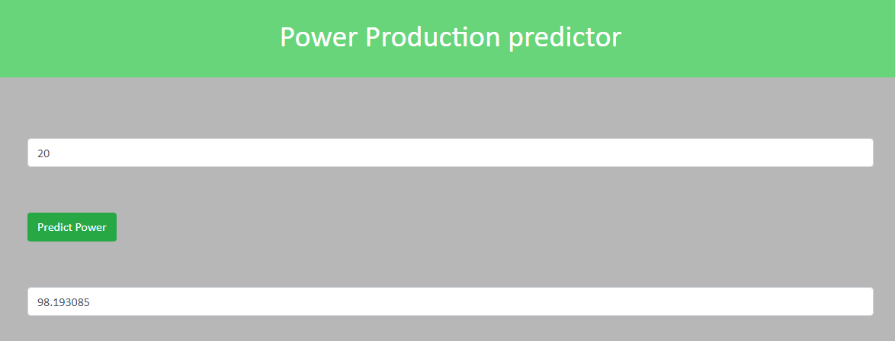

# Machine learning and Statistics - Project

### Author: Doris Zdravkovic

 

#### Aim of the project

The aim of this project is to create a web service that uses machine learning to make predictions based on the data set powerproduction. The goal is to produce a model that accurately predicts wind turbine power output from wind speed values, as in the data set. I will then develop a web service that will respond with predicted power values based on speed values sent as HTTP requests.

### Libraries used

#### Seaborn

Seaborn is a library for making statistical graphics in Python. It is built on top of matplotlib and closely integrated with pandas data structures.

Here is some of the functionality that seaborn offers:

- A dataset-oriented API for examining relationships between multiple variables
- Specialized support for using categorical variables to show observations or aggregate statistics
- Options for visualizing univariate or bivariate distributions and for comparing them between subsets of data
- Automatic estimation and plotting of linear regression models for different kinds dependent variables
- Convenient views onto the overall structure of complex datasets
- High-level abstractions for structuring multi-plot grids that let you easily build complex visualizations
- Concise control over matplotlib figure styling with several built-in themes
- Tools for choosing color palettes that faithfully reveal patterns in your data
- Seaborn aims to make visualization a central part of exploring and understanding data. Its dataset-oriented plotting functions operate on dataframes and arrays containing whole datasets and internally perform the necessary semantic mapping and statistical aggregation to produce informative plots.For more information about seaborn go to: https://seaborn.pydata.org/introduction.html

#### Jupyter Notebook

The Jupyter Notebook is an open-source web application that allows you to create and share documents that contain live code, equations, visualizations and narrative text. Uses include: data cleaning and transformation, numerical simulation, statistical modeling, data visualization, machine learning, and much more.

To install your jupyter notebook, you have to:

- Enter the startup folder by typing cd /folder_name .
- Run jupyter notebook command to launch the Jupyter Notebook App. The notebook interface will appear in a new browser window or tab.
- In the top right corner press New, Python 3 to open new file in jupyter
- Click ESC and key shortcut m to markdown or double click the text in the cell if you want to edit.
- You can run the notebook document step-by-step (one cell a time) by pressing shift + enter.
- You can run the whole notebook in a single step by clicking on the menu Cell -> Run All.
- Closing the browser (or the tab) will not close the Jupyter Notebook App. To completely shut it down you need to close the associated terminal.
- For more information about Jupyter notebook go to: https://jupyter.readthedocs.io/en/latest/

#### Downloading the repository

1. Go to GitHub.
2. Navigate to the main page of the repository:https://github.com/doriszd/project_machine_learning
3. Under the repository name, click Clone or download
4. Save the repository to a local folder location on your computer.
5. Navigate to your target directory in the command line
6. To add new content on gitHub type add .
7. Type git commit -m "Write a message here"
8. To send it to gitHub type git push

#### Contents of this repository

1. dockerignore
- allows you to specify a pattern for files and folders that should be ignored by the Docker client when generating a build context
2. gitignore
- ignores all files that you don't want to push on git. It is very important tool when you work with virtual machine
3. Dockerfile
- is a text document that contains all the commands a user could call on the command line to assemble an image. 
4. requirements.txt
- is used for specifying what python packages are required to run the project you are working on. Typically the requirements. txt file is located in the root directory of the project.
5. server.py
- python file that runs flask server to make predictions base on the model I used in the report. 
5. model.h5
- keras neural network model saved in jupyter notebook used for making power predictions.

#### Step by step guide:

Once I made sure all programmes and packages are properly installed and updated I ran my application. 

###### Docker
- docker -- version: to check if docker is properly installed and see the docker version
- docker image ls: to check all the images built in docker
- docker run -d -p 5000:5000 projections-image: once you decide which image to use run docker image. 

###### Virtual machine
- .\venv\Scripts\activate.bat: to activate virutal machine
- pip install -r requirements.txt: to install all the packages needed to run the application listed in requirements.txt

###### Server.py
- set FLASK_APP=server.py: using server.py script
- python -m flask run: to get the server running in the virtual environment 
- I got a message saying: "Running on http://127.0.0.1:5000/"
- I ran http://127.0.0.1:5000/ on my web browser. 
 
Once I ran http://127.0.0.1:5000/ on my local machine I entered power production web site. As the goal of this project was to produce a model that accurately predicts wind turbine power output from wind speed values, in the screenshot below you can see the example of the application that runs properly. I tested 3 different models: linear regression, polynomial regression and neural network. I decided to proceede with neural network as it 
 
 
 
 

 
 
 

